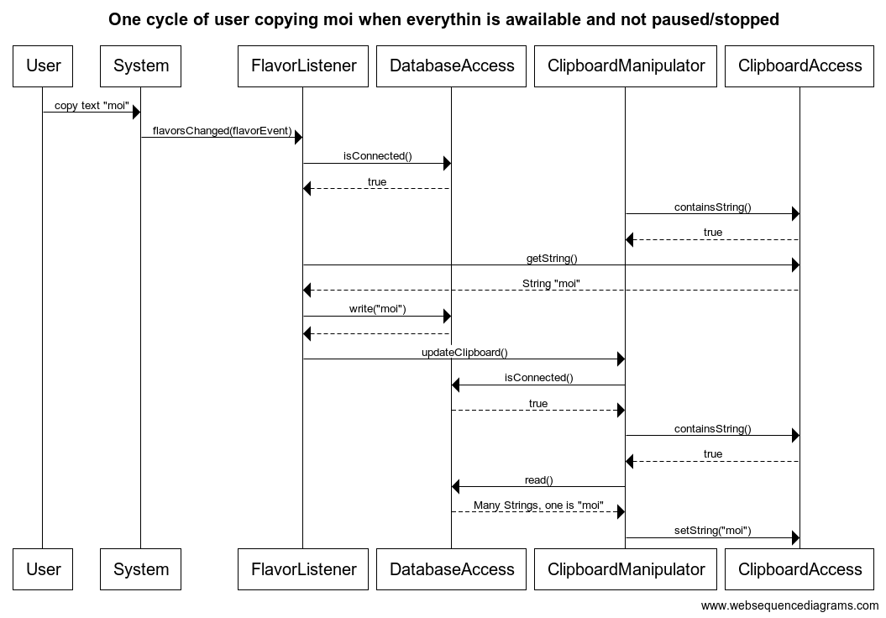

# Arkkitehtuurikuvaus
Ohjelma on rakentunut kolmeen kerrokseen
* **dao** sisältää tietokantoihin liittyvät asiat.
* **domain** sisältää "pellin alla" olevan toiminnallisuuden.
* **ui** sisältää käyttöliittymään liittyvät asiat

Sovelluksen logiikka on lopulta vain ClipboardManipulator luokka joka muuttaa leikepöydällä olevia asioita ClipboardManipulator luokan avulla ja tietokannassa olevia asioita DatabaseAccess luokkien avulla.

ClipboardManipulator tuottaa tapahtumankuuntelija, joka päivittää tietokantaa kun leikepöydälle kopioidaan tekstiä. Vastaavasti ClipboardManipulatorilla on metodi, joka päivittää joka sekunti leikepöydän sen perusteella mitä tietokannassa on.

# Kuva arkkitehtuurista

# Kuva siitä kun käyttäjä kopioi moi

