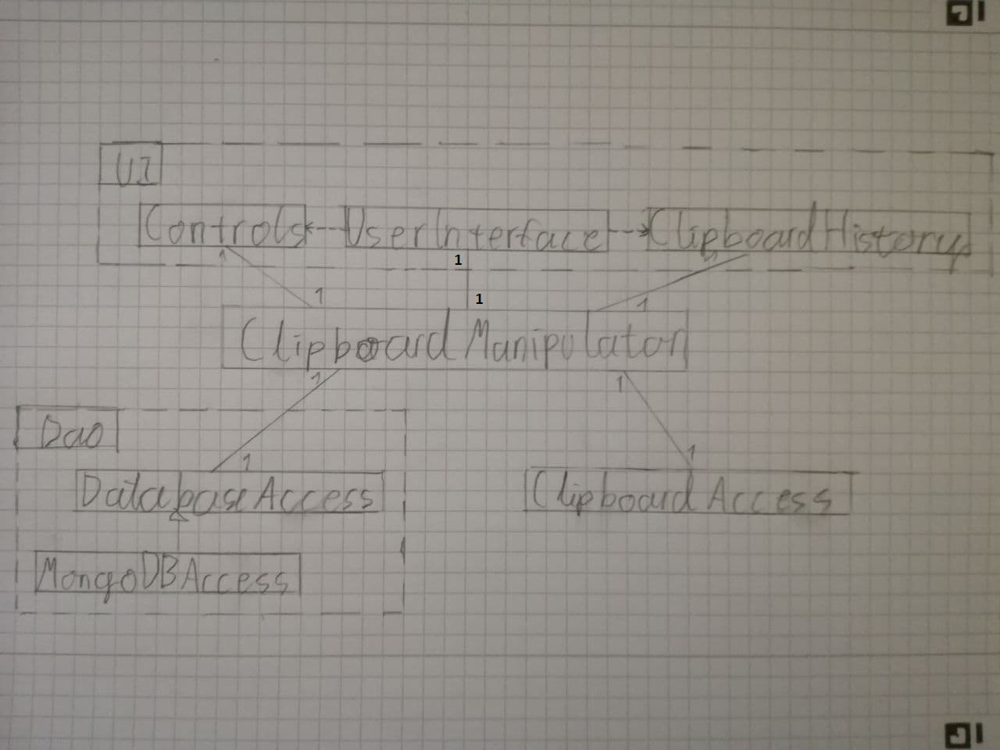

# Arkkitehtuurikuvaus
The program is made of 3 layers that all have theyr own package.
* **dao** contains the means to interact with databases.
* **domain** contains the local funktionality that the user can not see.
* **ui** contains the elements for the graphical user interface.

The program is mainly based on the class ClipboardManipulator, that sencronises the clipboard through the ClipboardAccess class and the Database through a DatabaseAccess class. Clipboardmanipulators main funktionalities are: giving an event listener to update the database when new text is copied and haveing a method to update the local clipboard according to the database.

A lot of complexity in the class ClipboardManipulator is caused by the definition of what is considered a clipboard event. Because an event occurs only when the filetype copied changes, or the program that was copied from or put the copy. For the program to get 2 events when 2 texts are copied from the same program, the clipboard is rewritten with the same text on every copy, to change what program changed the clipboad content. (This triggers another event that is ignored.)

The use of mongoDB Atlas was not a good choise. Because of this the dao package may be changed a lot if the development continues.

# User interface
The userinterface consists of the current history and some controls on the bottom of the window.

# Class architecture

# What happens when the user uses copy on text "moi"

