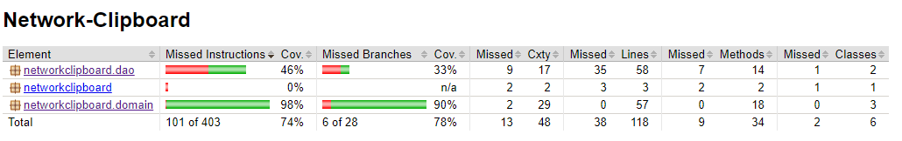

# Testausdokkumentti

The program has currenty only unit test for the packages *domain* and *dao*. Because of this development is slowed down by manual testing.

As you can see the *doa* package is lacking a lot of tests. This is because setting up database tests would be slow and the database object changing nature blocks the option to mock a database. The efford did not seem worth for something that is most likely changed entirely.

The *ui* package is not tested at all, and because of this it has to be tested manually every time. The nature of JavaFX also makes it so that it has to be tested on multiple operating systems seperately.

In short the testing sucks and the motivation to improve it is low, because the program is in such an early state that it goes through bit changes. I consider this Java version to be a MVP and the program has to be rewritten(if people like it, including me). The main reason for this is that Java is not commonly found on computers anymroe.

# Manual testing
Testing all the functionality described in [vaatimusmäärittely](./vaatimusmaarittely.md) on Windows 10 and Cubbli Linux at the same time. By doing these at the same time you can make sure that the history is syncronised between 2 devices.

# Problems in the program
* In the current version the application freezes when the internet connection is lost. Help to fix this is appreciated. The most likely solution will be to change away from mongoDB Atlas.
